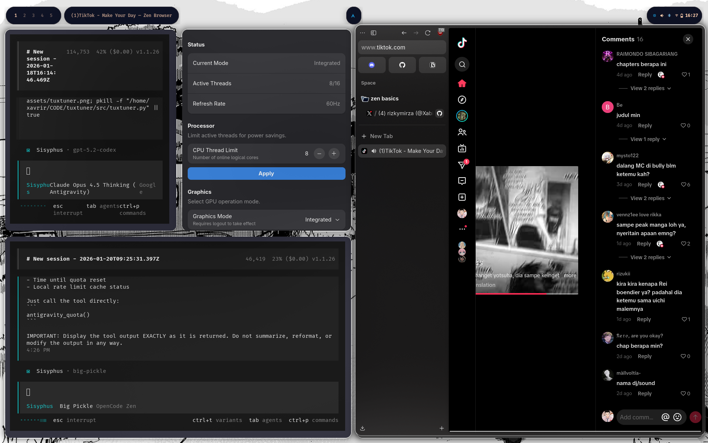

# TuxTuner

**Wayland-native performance control for ASUS gaming laptops on Linux.**

A GTK4 control center for GPU modes, CPU thread limiting, and display refresh rates. Built for ROG laptops running Hyprland, GNOME, or other Wayland compositors.

If Armoury Crate worked on Linux, it would look like this.

---

## Features

- **GPU Mode Switching** - Switch between Hybrid and Integrated graphics via supergfxctl, with automatic session logout
- **CPU Thread Limiting** - Dynamically enable/disable CPU threads (1 to max) for power savings
- **Refresh Rate Control** - Toggle between 60Hz and your panel's maximum refresh rate
- **Native GTK4/libadwaita UI** - Looks and feels like a proper GNOME system utility
- **Wayland-first** - Designed for Hyprland and modern Wayland compositors
- **No telemetry, no bloat** - Does exactly what it says, nothing more

---

## Screenshots



---

## Installation

### Arch Linux (AUR)

```bash
yay -S tuxtuner
```

### Manual Installation

```bash
git clone https://github.com/Xavrir/tuxtuner.git
cd tuxtuner
./install.sh
```

### Dependencies

- Python 3.10+
- GTK4 and libadwaita (`python-gobject`, `libadwaita`)
- Hyprland (for refresh rate control) or another Wayland compositor
- supergfxctl (optional, for GPU mode switching)
- pkexec/polkit (for privileged operations)

On Arch Linux:
```bash
sudo pacman -S python-gobject libadwaita
```

For GPU switching on ASUS laptops:
```bash
yay -S supergfxctl asusctl
```

---

## Usage

```bash
tuxtuner
```

Or launch from your application menu.

### GPU Mode Switching

1. Select your desired graphics mode (Hybrid or Integrated)
2. Click "Switch and Log Out"
3. Confirm the action - your session will terminate and you will return to your login screen
4. Log back in to use the new GPU mode

Note: GPU mode changes require a session restart. This is a hardware limitation, not a software one.

### CPU Thread Limiting

1. Adjust the slider or spin control to your desired thread count
2. Click "Apply"
3. Changes take effect immediately - no restart required

Reducing active threads can significantly improve battery life at the cost of multi-threaded performance.

### Refresh Rate

1. Select your desired refresh rate from the dropdown
2. The change applies immediately

Lower refresh rates reduce power consumption. 60Hz vs 165Hz can save 2-4W on a typical laptop panel.

---

## Supported Hardware

### Tested

- ASUS ROG Strix G16 (2024) - Intel 13th Gen + NVIDIA RTX 40 series
- ASUS ROG Zephyrus G14/G15/G16 (various generations)

### Should Work

- Any ASUS laptop supported by asusctl/supergfxctl
- Any Intel laptop with CPU hotplug support (most modern systems)
- Any Wayland compositor that supports hyprctl or wlr-randr for display control

### Limitations

- GPU switching requires supergfxctl and a compatible ASUS laptop
- Refresh rate control currently requires Hyprland (wlr-randr support planned)
- CPU0 cannot be disabled (kernel limitation)

---

## How It Works

TuxTuner is a frontend for existing Linux subsystems:

| Feature | Backend |
|---------|---------|
| GPU Mode | supergfxctl (asusctl ecosystem) |
| CPU Threads | sysfs `/sys/devices/system/cpu/cpuN/online` |
| Refresh Rate | hyprctl keyword monitor |
| Session Logout | loginctl terminate-session |

All privileged operations go through a helper script invoked via pkexec.

---

## FAQ

**Why does GPU switching require logout?**

NVIDIA GPU mode changes require the graphics driver to be fully unloaded and reloaded. This cannot happen while a graphical session is running. The only safe way to do this is to terminate your session.

**Will this break my system?**

No. TuxTuner only uses standard Linux interfaces (sysfs, supergfxctl, hyprctl). All changes are reversible. CPU and refresh rate changes are not persistent across reboots unless you configure them to be.

**Does this work on non-ASUS laptops?**

CPU thread limiting and refresh rate control work on any compatible hardware. GPU mode switching specifically requires supergfxctl and ASUS hardware.

**Does this work on GNOME/KDE/Sway?**

The CPU and GPU features work on any desktop. Refresh rate control currently requires Hyprland. Support for wlr-randr (Sway) and GNOME/KDE display APIs is planned.

**Is there any telemetry?**

No. TuxTuner does not collect any data, does not phone home, and never will.

---

## Roadmap

- [ ] AUR package
- [ ] Flatpak package
- [ ] wlr-randr support for Sway/other wlroots compositors
- [ ] GNOME/KDE display API support
- [ ] Power profiles integration (power-profiles-daemon)
- [ ] Battery threshold control (via asusctl)

---

## Contributing

Contributions are welcome. Please open an issue first to discuss major changes.

### Development Setup

```bash
git clone https://github.com/Xavrir/tuxtuner.git
cd tuxtuner
python3 src/tuxtuner.py
```

---

## Credits

Built on the work of:

- [asusctl / supergfxctl](https://gitlab.com/asus-linux/asusctl) - The asus-linux project
- [Hyprland](https://hyprland.org/) - Wayland compositor
- [GTK4 / libadwaita](https://gnome.org/) - GNOME Project

---

## License

MIT License. See LICENSE file.

---

If this tool saved you time, please consider starring the repository.
